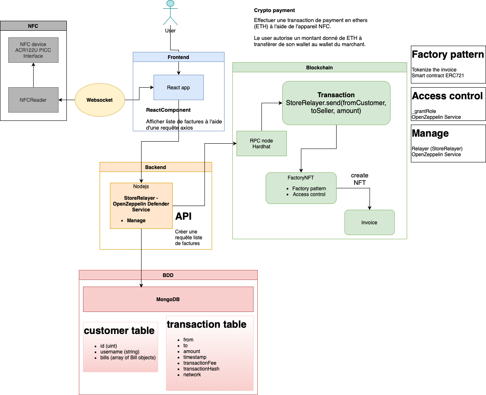
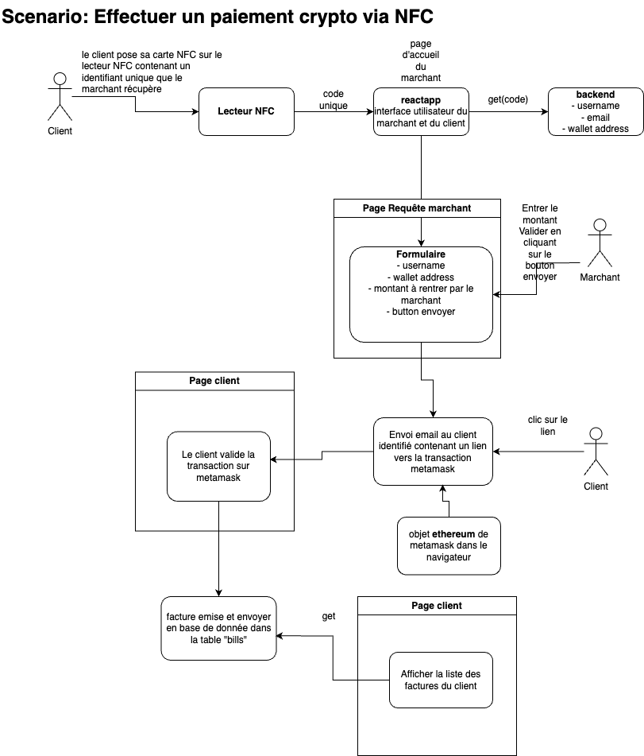

# cryptoNFC

## Purpose

The aim of the project is to use NFC technology for cryptocurrency payment

## Installation

to start a mongodb database
```shell
make
```


## Description

### Architectural diagram


### Scenario payment


### Frontend
    - React
    - Javascript

### Backend
    - Nodejs
    - Typescript
    - Manage - OpenZeppelin Service
        -> Relayer

### Database
    - Mongodb

### Blockchain
    - Access control - OpenZeppelin Service
    - Smart contract NFT Factory

### Git flow


## Contributing

- [Hanane](https://github.com/ulyh)


## License

Distributed under the GNU GENERAL PUBLIC LICENSE. See `LICENSE` for more information.


