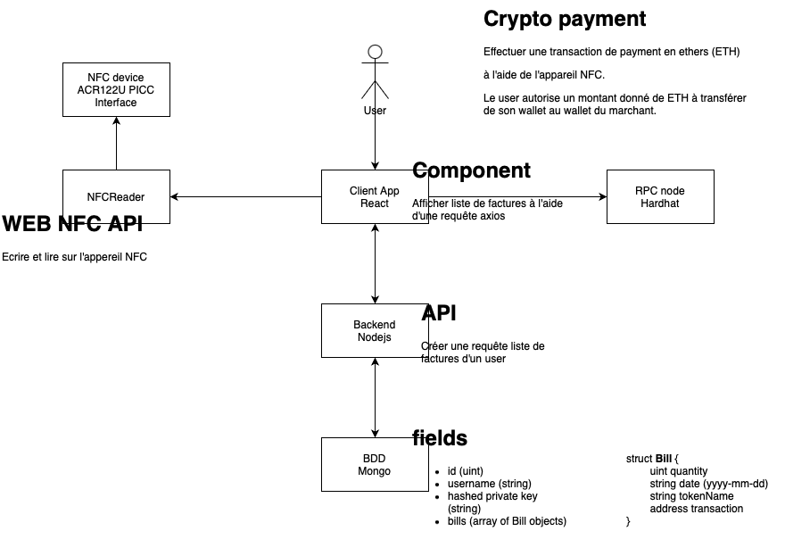

# crypto_payment_NFC

## Purpose

The aim of the project is to use NFC technology for cryptocurrency payment

## Installation

to start a mongodb database
```shell
make
```


## Description

### Architectural diagram


### Scenario payment


### Frontend
    - React
    - Javascript

### Backend
    - Nodejs
    - Typescript

### Database
    - Mongodb

### Git flow


## Contributing

- [Hugo](https://github.com/Ascensian)
- [Youssouf](https://github.com/ymistercap)
- [Hanane](https://github.com/ulyh)


## License

Distributed under the GNU GENERAL PUBLIC LICENSE. See `LICENSE` for more information.


